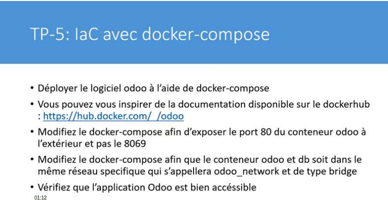
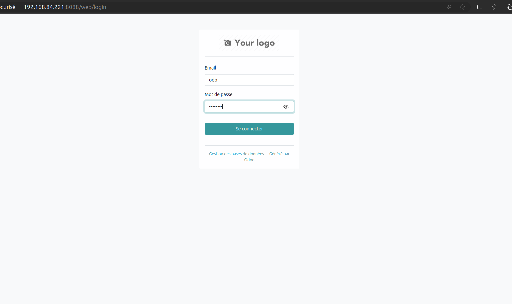
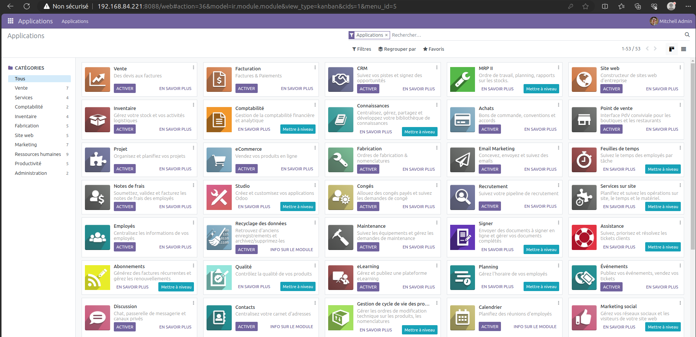

## Prérequis
- Docker 
- Docker Compose

## Installation des prérequis
Pour installer nos prérequis d'un coup nous allons créer un script bash et l'exécuter pour l'installation

<strong>- création du script</strong>
```
touch install.sh
```
<strong>- contenu</strong>
```
sudo yum update -y
sudo yum install -y yum-utils
sudo yum-config-manager --add-repo https://download.docker.com/linux/centos/docker-ce.repo
sudo yum install -y docker-ce docker-ce-cli containerd.io docker-buildx-plugin docker-compose-plugin
sudo systemctl enable docker
sudo systemctl start docker
```
<strong> - Changer les permissions pour l'exécution</strong><br/>
```
sudo chmod +x install.sh && sudo ./install.sh
```

## Mise en place de l'IAC avec docker-compose

**Pourquoi utiliser docker-compose ?**

Il est souvent nécessaire qu’une application ait besoin d’exécuter plusieurs conteneurs pour différentes tâches. Par conséquent, il peut s’avérer complexe de les exécuter séparément, tout en les faisant communiquer. C’est là que Docker Compose intervient et facilite grandement la tâche.

```
version: '3.8'
services:
  web:
    image: odoo:16.0
    depends_on:
      - db
    ports:
      - 80:8069
    volumes:
      - odoo-web-data:/var/lib/odoo
      - ./config:/etc/odoo
      - ./addons:/mnt/extra-addons
    networks:
      - odoo_network
  db:
    image: postgres:15
    environment:
      - POSTGRES_DB=postgres
      - POSTGRES_PASSWORD=odoo
      - POSTGRES_USER=odoo
      - PGDATA=/var/lib/postgresql/data/pgdata
    volumes:
      - odoo-db-data:/var/lib/postgresql/data/pgdata
    networks:
      - odoo_network

volumes:
  odoo-web-data:
  odoo-db-data:

networks:
  odoo_network:
    driver: bridge
```
### Description
Notre fichier docker-compose est composé de deux services.

<strong>- web</strong>
- `image: odoo:16.0` l'image odoo utilisée
- `depends_on:` permet de contrôler l'ordre de démarrage donc le service `db` va démarrer avant `web`
- `80:8069:`
- `volumes:` le mécanisme privilégié pour conserver les données générées et utilisées par les conteneurs Docker. nous avons un volume de type `nommé:` *(odoo-web-data)* et volume de type `bind`: *(./config)* dépendent de la structure des répertoires
- `networks:` Permet d'isoler les conteneurs dans un reséau privé.

<strong>- db </strong>
- `image: postgres:15` image utilisée pour la création du conteneur de la base de données 
- `environment:` permet de définir des variables d'environnement

## Exécution 
```
tp-5-iac-docker-compose$ docker-compose up -d
```
## Résultats

```
[+] Running 5/5
 ⠿ Network tp-5-iac-docker-compose_odoo_network    Created                                                                                                                                0.1s
 ⠿ Volume "tp-5-iac-docker-compose_odoo-web-data"  Created                                                                                                                                0.0s
 ⠿ Volume "tp-5-iac-docker-compose_odoo-db-data"   Created                                                                                                                                0.0s
 ⠿ Container tp-5-iac-docker-compose-db-1          Started                                                                                                                                0.3s
 ⠿ Container tp-5-iac-docker-compose-web-1         Started   
```
```
docker/TP/tp-5-iac-docker-compose$ docker-compose ps
NAME                            COMMAND                  SERVICE             STATUS              PORTS
tp-5-iac-docker-compose-db-1    "docker-entrypoint.s…"   db                  running             5432/tcp
tp-5-iac-docker-compose-web-1   "/entrypoint.sh odoo"    web                 running             8071-8072/tcp, 0.0.0.0:80->8069/tcp, :::80->8069/tcp
```

Pour s'assurer que tout marche bien on se rend à : **192.168.84.221**

----

----

----

----
----

----

## Conclusion

Docker Compose est un outil puissant pour le déploiement et la gestion d’applications multi-conteneurs. A l'aide un fichier YAML configuré , on peut orchestrer efficacement des services, volumes et réseaux.

