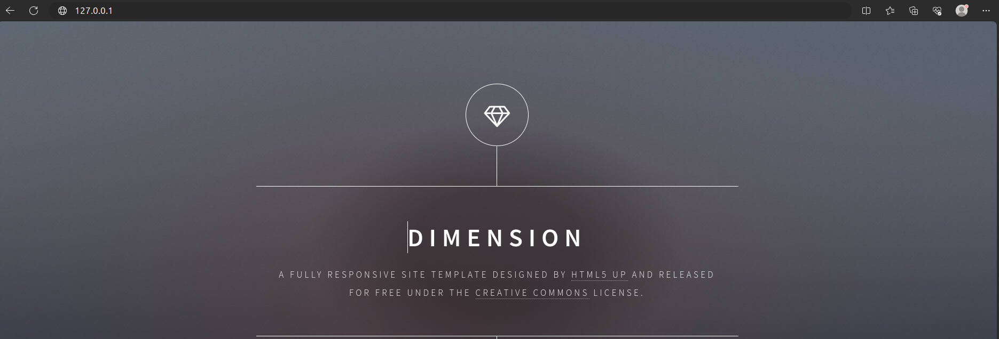
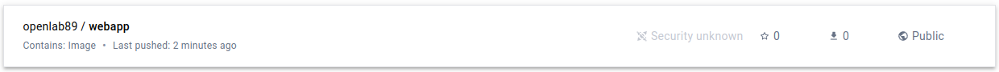

## TP-2 : Gérez vos images Docker
- Créer votre propre image
- Tester votre image
- Gérer vos images sur le dockerhub

## TAF
L'image à créer dans ce TP sera tout simplement un serveur web qui va utiliser le code de notre site web.
Pour se faire :
- Il faudra installer le serveur web
- Cloner le site internet
- lancer le serveur web

## Mise en place

**- Création du répertoire de base et du Dockerfile**

```
mkdir -p tp-2-gestion-des-images/Dockerfile
```
**- Edition du Dockerfile**

```
FROM ubuntu:18.04
LABEL maintainer="Assouman GBANE"
RUN apt-get update
RUN DEBIAN_FRONTEND=noninteractive apt-get install -y nginx git
RUN rm -Rf /var/www/html/*
RUN git clone https://github.com/diranetafen/static-website-example.git /var/www/html/
EXPOSE 80
ENTRYPOINT ["/usr/sbin/nginx", "-g", "daemon off;"]
```
**Description**

Ce Dockerfile permet de:
- utiliser ubuntu:18.04 comme image de base
- Mettre à jour le répos 
- installer nginx et git 
- supprime le site par défaut de nginx dans /var/www/html/
- cloner le site dans le dossier var/www/html/ de l'image
- exposer le port 80 et lancer le serveur

**- Build de l'image**

```
tp-2-gestion-des-images$ docker build -t webapp:v1 .
```
**Résultat**

```
Sending build context to Docker daemon  5.632kB
Step 1/8 : FROM ubuntu:18.04
 ---> f9a80a55f492
Step 2/8 : LABEL maintainer="Assouman GBANE"
 ---> Using cache
 ---> b6e3c2829b29
Step 3/8 : RUN apt-get update
 ---> Using cache
 ---> 3a938d7c7fb8
Step 4/8 : RUN DEBIAN_FRONTEND=noninteractive apt-get install -y nginx git
 ---> Using cache
 ---> 345c2b4ea22f
Step 5/8 : RUN rm -Rf /var/www/html/*
 ---> Using cache
 ---> e5c49fd658f9
Step 6/8 : RUN git clone https://github.com/diranetafen/static-website-example.git /var/www/html/
 ---> Using cache
 ---> 1a509daa5553
Step 7/8 : EXPOSE 80
 ---> Using cache
 ---> 65a5eebe2eac
Step 8/8 : ENTRYPOINT ["/usr/sbin/nginx", "-g", "daemon off;"]
 ---> Using cache
 ---> 0fd16b785315
Successfully built 0fd16b785315
Successfully tagged webapp:v1
```

**- Test de l'image**

```
tp-2-gestion-des-images$ docker run --name webapp -p 80:80 -d webapp:v1
```
```
tp-2-gestion-des-images$ docker ps
CONTAINER ID   IMAGE       COMMAND                  CREATED         STATUS         PORTS                                   NAMES
347fc4cb054b   webapp:v1   "/usr/sbin/nginx -g …"   2 minutes ago   Up 2 minutes   0.0.0.0:80->80/tcp, :::80->80/tcp   webapp
```
**- Test de connectivité**

il faut tester si l'image est fonctionnelle en accédant au site static déployé




**- Push vers DockerHub**

On peut maintenant arrêter et supprimer notre conteneur webapp

```
docker stop webapp && docker rm webapp
```
```
docker tag webapp:v1 openlab89/webapp:v1
```
**-  Vérification**
```
tp-2-gestion-des-images$ docker images |grep webapp
webapp                             v1           0be4e325d4dc   3 minutes ago   257MB
openlab89/webapp                   v1           0be4e325d4dc   3 minutes ago   257MB
```
**- Login à DockerHub**
```
tp-2-gestion-des-images$ docker login 
Authenticating with existing credentials...
WARNING! Your password will be stored unencrypted in /home/gbane/.docker/config.json.
Configure a credential helper to remove this warning. See
https://docs.docker.com/engine/reference/commandline/login/#credentials-store

Login Succeeded
``` 
**Push vers DockerHub**

```
tp-2-gestion-des-images$ docker push openlab89/webapp:v1 
The push refers to repository [docker.io/openlab89/webapp]
88bf308b49aa: Pushed 
51f9c0840a66: Pushed 
fd4ec4c17862: Pushed 
19a351eac10e: Pushed 
548a79621a42: Pushed 
v1: digest: sha256:265eb4d699718cf1624e9e0c988670042fcd0ad3b1081cc46a2bba9676c855e4 size: 1371
```



