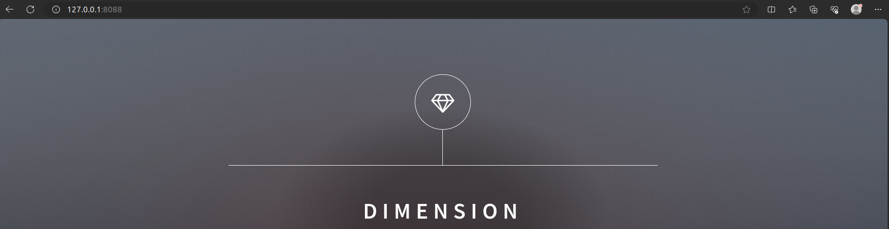

# TP-3 : Gérez votre stockage persistent
- Créez un volume de type volumes
- Créez deux conteneurs ubuntu (ubuntu1 et ubuntu2) et montez le volume créé dans le répertoire /tmp de chacun des conteneurs ubuntu
- Créez un fichier toto.txt dans le répertoire /tmp de ubuntu1 et vérifie qu'il est bien présent dans /tmp de ubuntu2
- Créez un conteneur apache dont le site internet affiché sera celui hébergé ici : https://github.com/diranetafen/static-website-example.git (utilisez le volume de type bind mount), n'oubliez pas de vérifier que le site est bien accessible


## TAF

### STOCKAGE DE TYPE VOLUMES
**- Création du volume**

```
docker volume create --name mon-volume
```

**- Création du conteneur 1**

```
docker run -itd --name ubuntu1 -v mon-volume:/tmp ubuntu /bin/bash
```

**- Création du conteneur 2**

```
docker run -itd --name ubuntu2 -v mon-volume:/tmp ubuntu /bin/bash
```

**- Se connecter au conteneur 1 et créér le fichier toto.txt**

```
docker exec -it ubuntu1 /bin/bash
```
```
touch /tmp/toto.txt
```
**- Connexion au conteneur 2 et vérification de la présence du fichier**

```
docker exec -it ubuntu2 /bin/bash
```
```
ls -lai /tmp/
```
```
root@c65661a813ad:/# ls /tmp/
toto.txt
```
### STOCKAGE DE BIND MOUNT

On va cloner localement le projet static-website-example de Dirane Tafen :

```
git clone https://github.com/diranetafen/static-website-example.git
```

```
Clonage dans 'static-website-example'...
remote: Enumerating objects: 75, done.
remote: Counting objects: 100% (28/28), done.
remote: Compressing objects: 100% (16/16), done.
remote: Total 75 (delta 12), reused 12 (delta 12), pack-reused 47
Réception d'objets: 100% (75/75), 669.30 Kio | 481.00 Kio/s, fait.
Résolution des deltas: 100% (13/13), fait.
```

On va créer un conteneur et monter en mode bind mount, le répertoire cloné.

```
docker run -dit --name webserver -p 8080:80 -v ${PWD}/static-website-example:/usr/local/apache2/htdocs httpd
```

```
~$ docker ps
CONTAINER ID   IMAGE     COMMAND              CREATED         STATUS         PORTS                                   NAMES
4ba46057eced   httpd     "httpd-foreground"   6 seconds ago   Up 5 seconds   0.0.0.0:8088->80/tcp, :::8088->80/tcp   webserver
```
